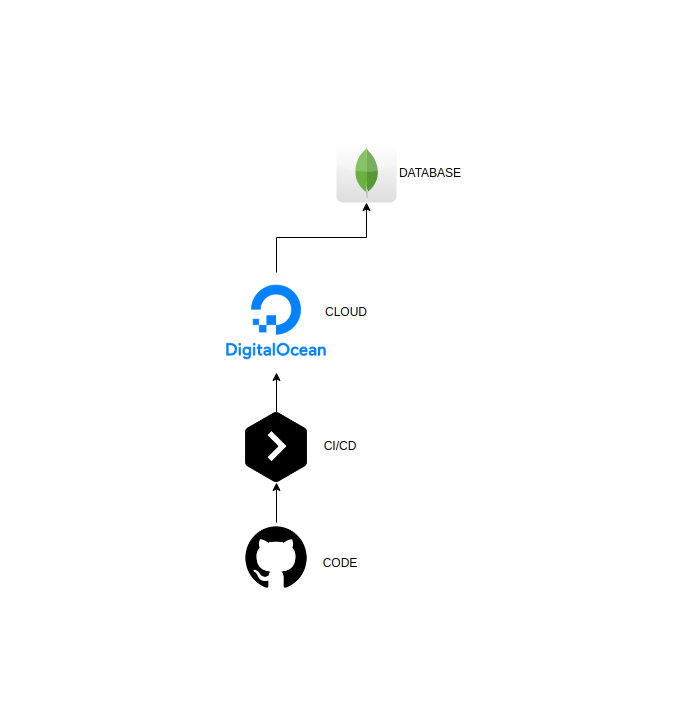

## API

Install

```
npm install
```

Run with Node

```
npm start
```

Run with Nodemon

```
npm run dev
```

Run ESlint

```
npm run lint
```

Run with Docker and docker-compose

```
docker-compose up
```

### ENV

```
#PORT=
MAIL_HOST=
MAIL_PORT=
MAIL_USER=
MAIL_PASS=
MONGO_URL=
JWT_KEY=
```

### ARCH



### Services

- Digital Ocean Cloud

- Github

- Buddy CI CD

- MongoDB - Mongo Atlas Database NoSQL

- Nginx - Proxy reverso
